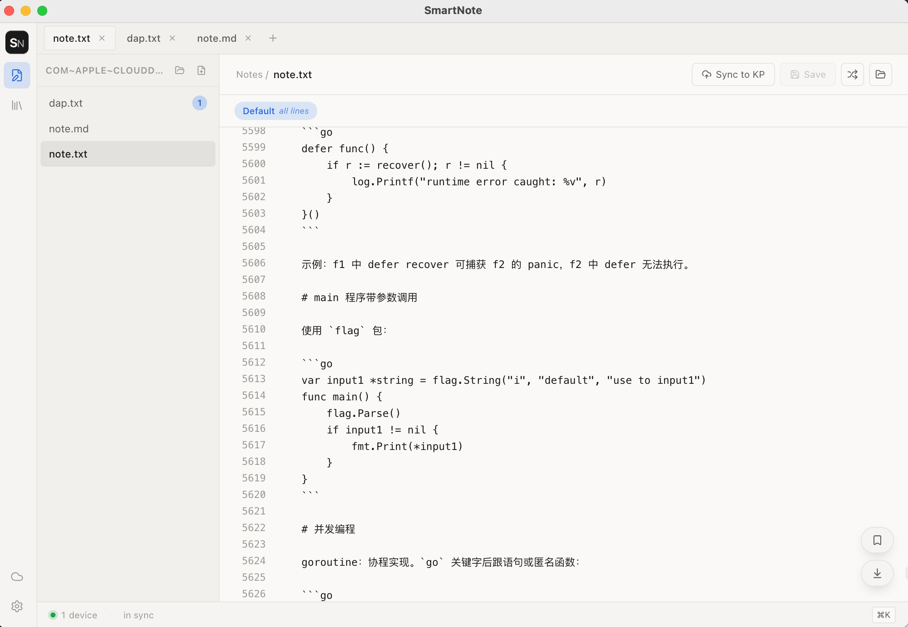
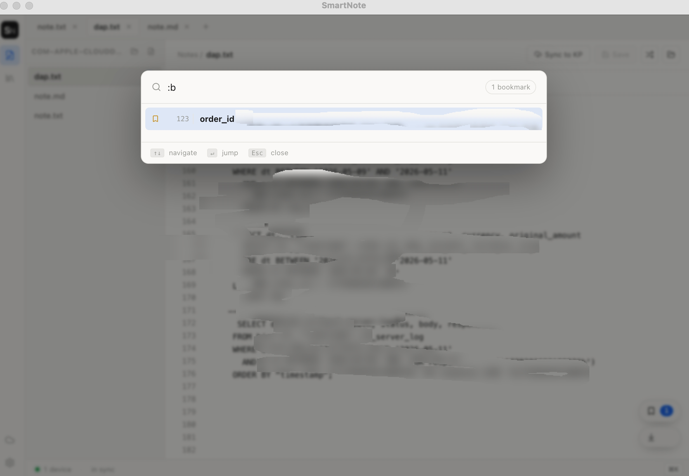
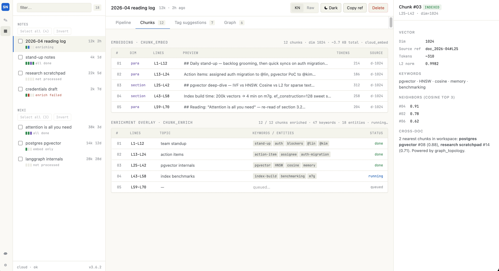
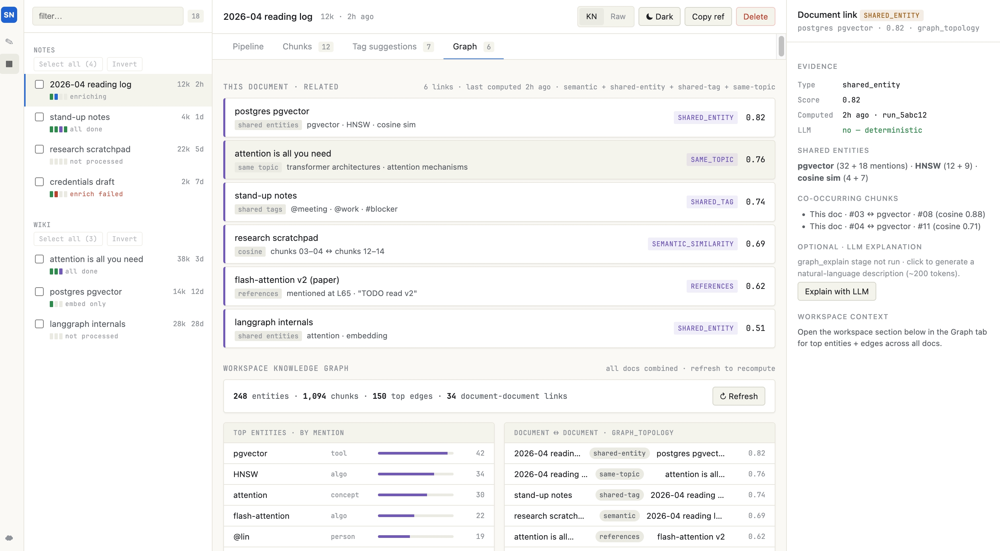
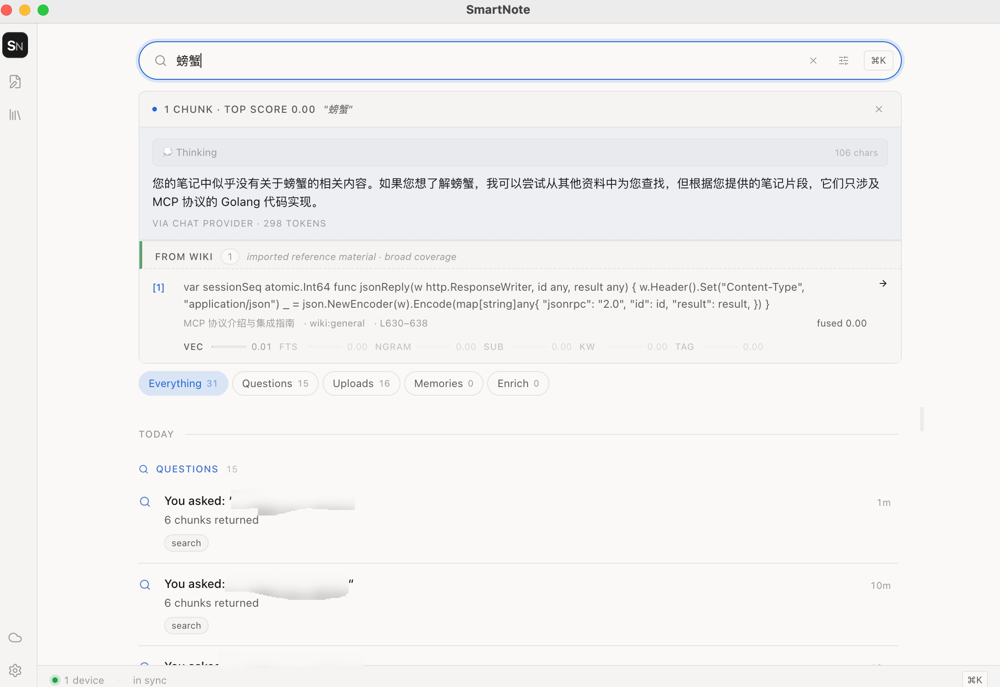
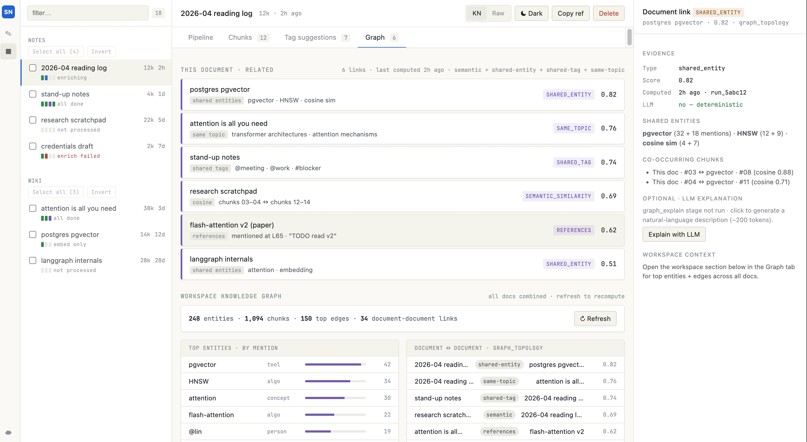

<p align="center">
  
</p>

<h1 align="center">SmartNote</h1>

<p align="center">
  <strong>Local-first notes that your AI agents can actually read.</strong><br/>
  Markdown on your disk · pgvector + LLM enrichment in the cloud ·
  exposed to Claude Code / Cursor / Opencode through MCP.
</p>

<p align="center">
  <a href="#-quick-start">Quick Start</a> ·
  <a href="#-features">Features</a> ·
  <a href="#-architecture">Architecture</a> ·
  <a href="#-mcp-for-ai-agents">MCP</a> ·
  <a href="#-troubleshooting">Troubleshooting</a>
</p>

<p align="center">
  
  
  
  
  
</p>

<p align="center">
  
</p>

---

## Why SmartNote

Most note tools either trap your data behind a SaaS wall or leave the AI side to you. SmartNote splits the difference:

- 📂 **Files stay yours.** Notes are plain Markdown on disk. Edit them in Obsidian, VS Code, vim — anything. SmartNote watches the same files.
- ☁️ **Cloud does the work AI needs.** A small self-hosted FastAPI service chunks, embeds (pgvector), enriches with your LLM, and builds an entity graph across docs.
- 🤖 **Agents see your notes as first-class memory.** A native MCP server (no stdio shim, no local install) lets Claude Code / Cursor / Opencode call `search`, `add_memory`, `get_document`, `set_preference` — scoped to your workspace.
- 🔑 **One API key.** No SaaS account, no per-tool wiring. Issue once, paste anywhere.

---

## ✨ Features

<table>
<tr>
<td width="50%" valign="top">

### Bookmarks at your fingertips
`⌘B` on any line to bookmark — name it once, jump from anywhere. Double-tap **Shift** to open Quick Search, type **`:b`** to list every bookmark in the current file. `:42` jumps to line 42. All bookmarks sync to cloud so they follow you across machines.



</td>
<td width="50%" valign="top">

### See the data, not a black box
Chunks are not a black box: dim, line ranges, character count, embedding model. Enrichment overlay surfaces topic + keywords + status per segment. Right-side inspector shows the vector, L2 norm, and the nearest cross-doc neighbours.



</td>
</tr>
<tr>
<td width="50%" valign="top">

### Knowledge graph across docs
After enrichment, `graph_topology` finds cross-doc links — shared entities, shared tags, same topic, semantic similarity. The Graph tab shows this doc's neighbours up top, the whole workspace's entity rollup below.



</td>
<td width="50%" valign="top">

### Ask, with sources
Hybrid retrieval (vec · FTS · n-gram · sub · keyword · tag) across all your notes. AI composes a cited answer on top — `[1]` `[2]` markers map to the chunks below so you can verify. Reasoner models stream a "💭 Thinking" block first.



</td>
</tr>
</table>

---

## 🚀 Quick Start

You need **two** halves: a cloud (Docker) and a desktop (Electron). Total time: ~5 minutes.

### 1 · Bring up the cloud

```bash
git clone https://github.com/TIZ36/smart-note.git
cd smart-note
./scripts/restart-cloud.sh
```

This builds the API image, starts Postgres + pgvector + the embed service, and runs migrations. When it prints `✓ api healthy`, you have:

| Service | URL |
|---|---|
| REST API | `http://localhost:58000` |
| MCP endpoint | `http://localhost:58000/mcp/` |
| Postgres | `localhost:55432` |
| Embedding service | `http://localhost:58009` |

### 2 · Mint a workspace API key

```bash
./scripts/issue-cloud-apikey.sh
```

You get an `sn_live_…` token printed **once**. Save it.

### 3 · Run the desktop

```bash
cd desktop
npm install
npm run electron:dev
```

The Electron window opens. Click the cloud icon on the rail → paste the URL (`http://localhost:58000`) + the `sn_live_…` token → Save.

That's it. Open a `.md` file via the `+` button and start writing. The desktop syncs to cloud on save; embedding fires automatically.

> **First run takes longer**: the embed-model image downloads ~600 MB. Subsequent boots are seconds.

<details>
<summary><strong>Build a signed .app / .dmg</strong></summary>

```bash
cd desktop
npm run electron:build      # output: desktop/dist/
```
</details>

<details>
<summary><strong>Tear down / reset</strong></summary>

```bash
# Stop cloud, keep data
cd cloud/infra && docker compose down

# Stop + wipe DB (clean slate)
cd cloud/infra && docker compose down -v
```
</details>

---

## 🤖 MCP for AI agents

SmartNote exposes a native MCP streamable-HTTP endpoint. **No stdio bridge, no spawn, no absolute paths**. Any modern MCP client connects with just URL + bearer token.

### Claude Code · Cursor · Opencode

Project-scoped config (e.g. `.mcp.json`):

```json
{
  "mcpServers": {
    "smartnote": {
      "url": "http://localhost:58000/mcp/",
      "headers": {
        "Authorization": "Bearer sn_live_..."
      }
    }
  }
}
```

### Tools the agent gets

| Tool | What it does |
|---|---|
| `search` | **Default lookup** — fans out to memories ∪ document chunks in parallel, merges by score. |
| `search_memory` / `search_documents` | Source-scoped variants. |
| `add_memory` · `set_preference` | Persist a fact or preference (supersede history kept). |
| `propose_memory` | Submit a draft for user review (lands in Library → Pending). |
| `add_document` | Upload + chunk + embed a long-form note. |
| `get_document` · `get_memory` | Fetch full content by id. |
| `queue_enrich_jobs` · `submit_enrichments` | Drive cloud-side LLM enrichment. |
| `set_enrich_provider` | Configure the workspace's cloud-side LLM. |

Every tool is workspace-scoped via the bearer key — one workspace per key, one machine config covers every agent on that machine.

---

## 🏗 Architecture

<p align="center">
  
  <br/>
  <sub><i>The Library surface — every doc's pipeline, segments, and cross-doc graph in one window.</i></sub>
</p>

```
┌──────────────────────────┐                ┌─────────────────────────────┐
│  Desktop (Electron)      │  HTTPS / WSS   │  Cloud (single Docker host) │
│                          │ ◄────────────► │                              │
│  • React renderer        │                │  ┌──────────────────────┐    │
│  • main.mjs IPC          │                │  │ FastAPI (cloud/api/) │    │
│  • Markdown editor       │                │  │   /v1/* REST         │    │
│  • Multi-tab workspace   │                │  │   /v1/device/relay   │ ◄──┼─ desktop WS
│  • ⌘K Spotlight          │                │  │   /mcp (streamable)  │ ◄──┼─ AI agents (MCP)
│  • Bookmarks (cloud)     │                │  └──────────┬───────────┘    │
└──────────────────────────┘                │             │                │
                                            │  ┌──────────▼───────────┐    │
                                            │  │ Postgres + pgvector  │    │
                                            │  │   documents          │    │
                                            │  │   chunks, blobs      │    │
                                            │  │   memories           │    │
                                            │  │   entities + links   │    │
                                            │  └──────────────────────┘    │
                                            │                              │
                                            │  ┌──────────────────────┐    │
                                            │  │ Embedding service    │    │
                                            │  │ (self-hosted)        │    │
                                            │  └──────────────────────┘    │
                                            └─────────────────────────────┘

Processing pipeline (per document):
  chunk_embed   ──►  chunk_enrich       ──►  graph_topology
   (chunks +         (LLM tags · topics       (cross-doc links:
    pgvector)         · entities · summary)    shared entities,
                                               shared tags)
                  └─►  wiki_abstract ────►    same                ← for wiki_topic docs
                       (chapter summary +
                        entities)
```

### Project layout

```
smart-note/
├── cloud/
│   ├── api/                  # FastAPI app
│   │   ├── app/
│   │   │   ├── routers/      # documents, memories, notes, preferences, …
│   │   │   ├── services/     # processing_runs, enrich, kb, embedding, …
│   │   │   ├── contexts/     # knowledge, storage event subscriptions
│   │   │   └── mcp_http.py   # MCP streamable-HTTP server
│   │   └── scripts/          # backfills + one-shot maintenance
│   ├── migrations/           # 0NN_*.sql, idempotent, run on startup
│   ├── infra/                # docker-compose.yml + .env
│   └── sdk-py, sdk-ts
├── desktop/
│   ├── electron/
│   │   ├── main.mjs          # IPC, hotkeys, WS presence, settings
│   │   └── services/         # settings, sync, ws-presence, notes, local-db
│   ├── public/               # icons (SVG + generated PNG + ICNS)
│   └── src/                  # React renderer (App, atelier, library, note)
└── prototypes/               # design HTML mocks (b is canonical)
```

---

## 📅 Daily Workflow

1. **Write** — open a `.md` file in any tab, type. ⌘S saves to disk and syncs to cloud.
2. **Embed** — happens automatically on sync. Watch the Library left-tree chip flip from `embed` → `done`.
3. **Enrich** — Library → select doc → Pipeline → **Run chunk_enrich** (notes) or **Build smartsheet** (wikis). Burns LLM tokens once.
4. **Topo** — same doc → **Run graph_topology**. Free, fast; finds cross-doc links.
5. **Search** — `⌘K` from anywhere, type your question. Retrieval shows the cited chunks; click ✨ **Compose answer** for the synthesized response (or it auto-runs on Enter).
6. **Recall via agents** — your Claude Code / Cursor session sees the workspace as a memory pool through MCP.

---

## ⚙️ Configuration

<details>
<summary><strong>Two LLM configs (cloud vs local) — what goes where</strong></summary>

| Config | Where | Powers |
|---|---|---|
| **Cloud AI provider** | Cloud panel → AI provider tab | Cloud-side enrich · wiki abstract · MCP classifier |
| **Local Chat provider** | Settings → Chat provider | Spotlight ⌘K answer compose · in-app rewrites |

Both speak OpenAI-compatible `/chat/completions`. Recommended:

- **Budget**: `deepseek-chat` at `https://api.deepseek.com/v1`
- **Quality**: `gpt-4o-mini` at `https://api.openai.com/v1`
- **Reasoner**: `deepseek-reasoner` (shows a "💭 Thinking" stream)

Set the cloud one via MCP (`set_enrich_provider` tool) or via the Cloud panel UI. Without it, enrich / wiki-abstract buttons stay disabled.
</details>

<details>
<summary><strong>Where credentials live on disk</strong></summary>

| Credential | File | Notes |
|---|---|---|
| Cloud URL + workspace key | `~/Library/Application Support/desktop/cloud-creds.json` | per-user, chmod 600 |
| Local provider api_key | same file | never ships to the renderer |
| Cloud-side enrich provider | Postgres `memories` (kind=preference) | per-workspace |
| Feature-flag prefs (.env) | `~/Library/Application Support/desktop/prefs/.env` | hotkey, embedding mode |

No file under `<repo>/server/` is ever created — that directory belonged to a retired Python gateway.
</details>

<details>
<summary><strong>Useful commands</strong></summary>

```bash
# Cloud
./scripts/restart-cloud.sh                            # rebuild + restart api (the right way)
cd cloud/infra && docker compose logs -f api          # tail live logs
cd cloud/infra && docker compose exec postgres psql -U smartnote -d smartnote   # SQL shell

# Desktop
cd desktop && npm run electron:dev                    # vite + electron (typical)
cd desktop && npm run dev                             # vite only (renderer hot-reload)
cd desktop && npx tsc --noEmit                        # type-check
cd desktop && npm run electron:build                  # produce .dmg / .app

# Maintenance
./scripts/clean-all-data.sh                           # wipe Postgres + restart cloud
./scripts/issue-cloud-apikey.sh                       # mint a new workspace key
```
</details>

<details>
<summary><strong>Migrations</strong></summary>

Cloud auto-runs SQL files from `cloud/migrations/` at startup in lexical order. Conventions:

- Filename: `0NN_short_name.sql`
- Every statement must be idempotent (`CREATE … IF NOT EXISTS`, `ADD COLUMN IF NOT EXISTS`)
- No migration ledger by design — keep them re-runnable

After adding a migration, `./scripts/restart-cloud.sh` picks it up on the next build.
</details>

---

## 🛟 Troubleshooting

<details>
<summary><strong>"Cloud not configured" in the desktop</strong></summary>

Open Cloud panel → Connection tab. URL must be reachable, API key must be valid. Test it:

```bash
curl -X POST http://localhost:58000/v1/auth/token \
  -H "Content-Type: application/json" \
  -d '{"api_key": "sn_live_…"}'
# expect: {"jwt": "...", "expires_at": …}
```

A 401 means the key was wiped (you ran `clean-all-data.sh`) — mint a new one.
</details>

<details>
<summary><strong>Restart didn't pick up my cloud code change</strong></summary>

`docker compose restart api` does **not** rebuild the image. The cloud has no live-mount; code is baked at build time.

Use `./scripts/restart-cloud.sh` (which runs `docker compose up -d --build api`).
</details>

<details>
<summary><strong>Library left-tree chip stuck on "running"</strong></summary>

Usually a missed WS event. The desktop has a 5s safety-net poll that reconciles in-flight runs, but if your cloud-creds went stale the WS won't connect at all. Check Electron stdout for `[ws-presence] auth: 401` — if you see it, re-mint a key and paste it back.
</details>

<details>
<summary><strong>Enrich button greyed out</strong></summary>

The cloud AI provider isn't set. Either:
- Cloud panel → AI provider tab → fill base URL + key + model → Save, or
- From an MCP-connected agent: call `set_enrich_provider(api_key=…, base_url=…, model=…)`
</details>

<details>
<summary><strong>Spotlight (⌘K) doesn't open</strong></summary>

- Some macOS app stole ⌘K — open Settings → Global hotkey → bind something else (e.g. `CommandOrControl+Alt+Space`).
- Fully quit Electron (⌘Q) and reopen — the global accelerator only registers on app start.
</details>

<details>
<summary><strong>"Provider returned no text"</strong></summary>

You're using a reasoner model (DeepSeek-Reasoner / o1) and it spent the entire token budget on hidden chain-of-thought. Either:
- Switch to `deepseek-chat` / `gpt-4o-mini`
- Wait — the IPC handler auto-bumps `max_tokens` to 4096 for reasoners, but a long doc + small max_tokens is still possible

The "💭 Thinking" block will show what the model was thinking even when `content` is empty.
</details>

---

## 🗺 Roadmap

- [ ] Auto-enrich after sync (currently manual to control LLM spend)
- [ ] Per-tab editor state preserved across tab switches
- [ ] iOS companion: capture → cloud → surfaces in desktop tree
- [ ] Multi-workspace switching in one desktop
- [ ] OAuth for shared workspaces

---

## License

MIT — see [LICENSE](LICENSE).

## Contributing

Issues and PRs at <https://github.com/TIZ36/smart-note>. For substantial changes, open an issue first to align on scope.
